# Security Guide

> Comprehensive security implementation and best practices for the Restaurant AI Platform

## Table of Contents

1. [Security Overview](#security-overview)
2. [Authentication & Authorization](#authentication--authorization)
3. [Data Protection](#data-protection)
4. [Network Security](#network-security)
5. [Application Security](#application-security)
6. [Infrastructure Security](#infrastructure-security)
7. [Compliance & Standards](#compliance--standards)
8. [Security Monitoring](#security-monitoring)
9. [Incident Response](#incident-response)
10. [Security Checklist](#security-checklist)

## Security Overview

The Restaurant AI Platform implements defense-in-depth security with multiple layers of protection:

- **Application Layer**: Input validation, authentication, authorization
- **Network Layer**: TLS encryption, firewall rules, network segmentation
- **Infrastructure Layer**: Container security, secrets management, resource isolation
- **Data Layer**: Encryption at rest and in transit, backup security
- **Monitoring Layer**: Real-time threat detection, audit logging, SIEM integration

### Security Architecture

```mermaid
graph TB
    subgraph "External"
        USER[User/Client]
        ATTACKER[🔴 Threat Actor]
    end
    
    subgraph "Edge Security"
        WAF[Web Application Firewall]
        DDoS[DDoS Protection]
        CDN[CDN with Edge Security]
    end
    
    subgraph "Network Security"
        LB[Load Balancer + SSL Termination]
        VPC[VPC Network Isolation]
        FW[Firewall Rules]
    end
    
    subgraph "Application Security"
        AUTH[Authentication Layer]
        AUTHZ[Authorization Engine]
        VALID[Input Validation]
        RATE[Rate Limiting]
    end
    
    subgraph "Infrastructure Security"
        K8S[Kubernetes RBAC]
        POD[Pod Security Policies]
        NET[Network Policies]
        SEC[Secret Management]
    end
    
    subgraph "Data Security"
        ENC[Encryption at Rest]
        TLS[TLS in Transit]
        BACKUP[Encrypted Backups]
        AUDIT[Audit Logging]
    end
    
    USER --> CDN
    ATTACKER -.-> WAF
    CDN --> WAF
    WAF --> DDoS
    DDoS --> LB
    LB --> VPC
    VPC --> FW
    FW --> AUTH
    AUTH --> AUTHZ
    AUTHZ --> VALID
    VALID --> RATE
    RATE --> K8S
    K8S --> POD
    POD --> NET
    NET --> SEC
    SEC --> ENC
    ENC --> TLS
    TLS --> BACKUP
    BACKUP --> AUDIT
```



## Authentication & Authorization

### JWT-Based Authentication

#### Token Structure
```json
{
  "header": {
    "alg": "HS256",
    "typ": "JWT"
  },
  "payload": {
    "sub": "user_id",
    "exp": 1640995200,
    "iat": 1640908800,
    "iss": "restaurant-ai-platform",
    "aud": "restaurant-ai-api",
    "role": "restaurant_owner",
    "permissions": ["menu:read", "menu:write", "analytics:read"],
    "restaurant_id": "550e8400-e29b-41d4-a716-446655440000"
  }
}
```

#### Implementation
```python
# backend/shared/auth.py
import jwt
from datetime import datetime, timedelta
from fastapi import HTTPException, Depends, status
from fastapi.security import HTTPBearer
from passlib.context import CryptContext
import redis
from typing import Optional, List

security = HTTPBearer()
pwd_context = CryptContext(schemes=["bcrypt"], deprecated="auto")
redis_client = redis.Redis(host='redis', port=6379, decode_responses=True)

class JWTManager:
    def __init__(self, secret_key: str, algorithm: str = "HS256"):
        self.secret_key = secret_key
        self.algorithm = algorithm
        self.access_token_expire = timedelta(minutes=1440)  # 24 hours
        self.refresh_token_expire = timedelta(days=30)

    def create_access_token(self, data: dict, expires_delta: Optional[timedelta] = None):
        to_encode = data.copy()
        expire = datetime.utcnow() + (expires_delta or self.access_token_expire)
        
        to_encode.update({
            "exp": expire,
            "iat": datetime.utcnow(),
            "iss": "restaurant-ai-platform",
            "aud": "restaurant-ai-api",
            "type": "access"
        })
        
        return jwt.encode(to_encode, self.secret_key, algorithm=self.algorithm)

    def create_refresh_token(self, user_id: str):
        to_encode = {
            "sub": user_id,
            "exp": datetime.utcnow() + self.refresh_token_expire,
            "iat": datetime.utcnow(),
            "type": "refresh"
        }
        
        token = jwt.encode(to_encode, self.secret_key, algorithm=self.algorithm)
        
        # Store refresh token in Redis with expiration
        redis_client.setex(
            f"refresh_token:{user_id}",
            int(self.refresh_token_expire.total_seconds()),
            token
        )
        
        return token

    def verify_token(self, token: str) -> dict:
        try:
            payload = jwt.decode(
                token, 
                self.secret_key, 
                algorithms=[self.algorithm],
                audience="restaurant-ai-api",
                issuer="restaurant-ai-platform"
            )
            
            # Check if token is blacklisted
            if redis_client.get(f"blacklist:{token}"):
                raise HTTPException(
                    status_code=status.HTTP_401_UNAUTHORIZED,
                    detail="Token has been revoked"
                )
                
            return payload
            
        except jwt.ExpiredSignatureError:
            raise HTTPException(
                status_code=status.HTTP_401_UNAUTHORIZED,
                detail="Token has expired"
            )
        except jwt.JWTError:
            raise HTTPException(
                status_code=status.HTTP_401_UNAUTHORIZED,
                detail="Invalid token"
            )

    def blacklist_token(self, token: str, exp: int):
        """Add token to blacklist until expiration"""
        ttl = exp - int(datetime.utcnow().timestamp())
        if ttl > 0:
            redis_client.setex(f"blacklist:{token}", ttl, "1")

# Password security
def hash_password(password: str) -> str:
    return pwd_context.hash(password)

def verify_password(plain_password: str, hashed_password: str) -> bool:
    return pwd_context.verify(plain_password, hashed_password)

def validate_password_strength(password: str) -> bool:
    """
    Password requirements:
    - At least 12 characters
    - At least one uppercase letter
    - At least one lowercase letter
    - At least one digit
    - At least one special character
    - No common passwords
    """
    import re
    
    if len(password) < 12:
        return False
    
    if not re.search(r"[A-Z]", password):
        return False
    
    if not re.search(r"[a-z]", password):
        return False
    
    if not re.search(r"\d", password):
        return False
    
    if not re.search(r"[!@#$%^&*(),.?\":{}|<>]", password):
        return False
    
    # Check against common passwords
    common_passwords = {
        "password123", "123456789", "qwerty123", 
        "admin123456", "welcome123", "password1234"
    }
    
    if password.lower() in common_passwords:
        return False
    
    return True
```

### Role-Based Access Control (RBAC)

#### Permission Model
```python
# backend/shared/permissions.py
from enum import Enum
from typing import List, Dict, Set
from dataclasses import dataclass

class Permission(Enum):
    # Restaurant permissions
    RESTAURANT_READ = "restaurant:read"
    RESTAURANT_WRITE = "restaurant:write"
    RESTAURANT_DELETE = "restaurant:delete"
    
    # Menu permissions
    MENU_READ = "menu:read"
    MENU_WRITE = "menu:write"
    MENU_DELETE = "menu:delete"
    
    # Analytics permissions
    ANALYTICS_READ = "analytics:read"
    ANALYTICS_WRITE = "analytics:write"
    
    # Admin permissions
    USER_MANAGE = "user:manage"
    SYSTEM_ADMIN = "system:admin"

class Role(Enum):
    CUSTOMER = "customer"
    RESTAURANT_STAFF = "restaurant_staff"
    RESTAURANT_MANAGER = "restaurant_manager"
    RESTAURANT_OWNER = "restaurant_owner"
    PLATFORM_ADMIN = "platform_admin"
    SUPER_ADMIN = "super_admin"

# Role permission mapping
ROLE_PERMISSIONS: Dict[Role, Set[Permission]] = {
    Role.CUSTOMER: {
        Permission.RESTAURANT_READ,
        Permission.MENU_READ
    },
    Role.RESTAURANT_STAFF: {
        Permission.RESTAURANT_READ,
        Permission.MENU_READ,
        Permission.MENU_WRITE
    },
    Role.RESTAURANT_MANAGER: {
        Permission.RESTAURANT_READ,
        Permission.RESTAURANT_WRITE,
        Permission.MENU_READ,
        Permission.MENU_WRITE,
        Permission.ANALYTICS_READ
    },
    Role.RESTAURANT_OWNER: {
        Permission.RESTAURANT_READ,
        Permission.RESTAURANT_WRITE,
        Permission.RESTAURANT_DELETE,
        Permission.MENU_READ,
        Permission.MENU_WRITE,
        Permission.MENU_DELETE,
        Permission.ANALYTICS_READ,
        Permission.ANALYTICS_WRITE,
        Permission.USER_MANAGE
    },
    Role.PLATFORM_ADMIN: {
        # All permissions except super admin
        perm for perm in Permission if perm != Permission.SYSTEM_ADMIN
    },
    Role.SUPER_ADMIN: set(Permission)  # All permissions
}

@dataclass
class UserContext:
    user_id: str
    role: Role
    restaurant_id: Optional[str] = None
    permissions: Set[Permission] = None
    
    def __post_init__(self):
        if self.permissions is None:
            self.permissions = ROLE_PERMISSIONS.get(self.role, set())

def check_permission(user: UserContext, required_permission: Permission) -> bool:
    return required_permission in user.permissions

def require_permission(permission: Permission):
    """Decorator to require specific permission"""
    def decorator(func):
        async def wrapper(*args, **kwargs):
            # Extract user context from request
            user = kwargs.get('current_user')
            if not user or not check_permission(user, permission):
                raise HTTPException(
                    status_code=status.HTTP_403_FORBIDDEN,
                    detail=f"Permission {permission.value} required"
                )
            return await func(*args, **kwargs)
        return wrapper
    return decorator
```

### Multi-Factor Authentication (MFA)

#### TOTP Implementation
```python
# backend/shared/mfa.py
import pyotp
import qrcode
import io
import base64
from typing import Optional

class MFAManager:
    def __init__(self):
        self.issuer_name = "Restaurant AI Platform"
    
    def generate_secret(self) -> str:
        """Generate a new TOTP secret"""
        return pyotp.random_base32()
    
    def generate_qr_code(self, user_email: str, secret: str) -> str:
        """Generate QR code for authenticator app setup"""
        totp_uri = pyotp.totp.TOTP(secret).provisioning_uri(
            name=user_email,
            issuer_name=self.issuer_name
        )
        
        qr = qrcode.QRCode(version=1, box_size=10, border=5)
        qr.add_data(totp_uri)
        qr.make(fit=True)
        
        img = qr.make_image(fill_color="black", back_color="white")
        img_buffer = io.BytesIO()
        img.save(img_buffer, format='PNG')
        img_buffer.seek(0)
        
        return base64.b64encode(img_buffer.getvalue()).decode()
    
    def verify_totp(self, secret: str, token: str) -> bool:
        """Verify TOTP token"""
        totp = pyotp.TOTP(secret)
        return totp.verify(token, valid_window=1)  # Allow 30-second window
    
    def generate_backup_codes(self) -> List[str]:
        """Generate one-time backup codes"""
        import secrets
        return [secrets.token_hex(4).upper() for _ in range(10)]
```

### OAuth2 Integration

#### Social Login Implementation
```python
# backend/shared/oauth.py
from authlib.integrations.fastapi_oauth2 import OAuth2
from authlib.integrations.httpx_oauth2 import AsyncOAuth2Client

class OAuthManager:
    def __init__(self):
        self.google_client = AsyncOAuth2Client(
            client_id=os.getenv('GOOGLE_CLIENT_ID'),
            client_secret=os.getenv('GOOGLE_CLIENT_SECRET'),
            authorize_url='https://accounts.google.com/o/oauth2/auth',
            token_url='https://accounts.google.com/o/oauth2/token',
            userinfo_url='https://www.googleapis.com/oauth2/v1/userinfo'
        )
    
    async def get_google_user_info(self, code: str) -> dict:
        """Exchange code for user information"""
        token = await self.google_client.fetch_token(
            code=code,
            redirect_uri=os.getenv('GOOGLE_REDIRECT_URI')
        )
        
        user_info = await self.google_client.get(
            'https://www.googleapis.com/oauth2/v1/userinfo',
            headers={'Authorization': f"Bearer {token['access_token']}"}
        )
        
        return user_info.json()
```

## Data Protection

### Encryption Implementation

#### Data at Rest
```python
# backend/shared/encryption.py
from cryptography.fernet import Fernet
from cryptography.hazmat.primitives import hashes
from cryptography.hazmat.primitives.kdf.pbkdf2 import PBKDF2HMAC
import base64
import os

class EncryptionManager:
    def __init__(self, master_key: bytes = None):
        if master_key is None:
            master_key = os.getenv('ENCRYPTION_KEY', '').encode()
        
        if not master_key:
            raise ValueError("Encryption key not provided")
        
        # Derive key from master key
        kdf = PBKDF2HMAC(
            algorithm=hashes.SHA256(),
            length=32,
            salt=b'stable_salt_for_restaurant_ai',  # Use dynamic salt in production
            iterations=100000,
        )
        key = base64.urlsafe_b64encode(kdf.derive(master_key))
        self.fernet = Fernet(key)
    
    def encrypt(self, data: str) -> str:
        """Encrypt sensitive data"""
        if not data:
            return data
        return self.fernet.encrypt(data.encode()).decode()
    
    def decrypt(self, encrypted_data: str) -> str:
        """Decrypt sensitive data"""
        if not encrypted_data:
            return encrypted_data
        return self.fernet.decrypt(encrypted_data.encode()).decode()
    
    def encrypt_pii(self, data: dict) -> dict:
        """Encrypt PII fields in data dictionary"""
        pii_fields = {'email', 'phone', 'address', 'credit_card'}
        encrypted_data = data.copy()
        
        for field in pii_fields:
            if field in encrypted_data and encrypted_data[field]:
                encrypted_data[field] = self.encrypt(str(encrypted_data[field]))
        
        return encrypted_data

# Database field encryption
from sqlalchemy_utils import EncryptedType
from sqlalchemy_utils.types.encrypted.encrypted_type import AesEngine

class EncryptedField(EncryptedType):
    def __init__(self, *args, **kwargs):
        secret_key = os.getenv('DB_ENCRYPTION_KEY')
        if not secret_key:
            raise ValueError("Database encryption key not provided")
        
        super().__init__(*args, secret_key, AesEngine, 'pkcs5', **kwargs)

# Usage in models
class User(Base):
    __tablename__ = "users"
    
    id = Column(UUID(as_uuid=True), primary_key=True, default=uuid.uuid4)
    email = Column(EncryptedField(String(255)), nullable=False, unique=True)
    phone = Column(EncryptedField(String(20)), nullable=True)
    created_at = Column(DateTime, default=datetime.utcnow)
```

#### Data in Transit
```python
# TLS Configuration
import ssl

def create_ssl_context():
    """Create secure SSL context"""
    context = ssl.create_default_context(ssl.Purpose.SERVER_AUTH)
    context.check_hostname = True
    context.verify_mode = ssl.CERT_REQUIRED
    context.minimum_version = ssl.TLSVersion.TLSv1_2
    
    # Disable weak ciphers
    context.set_ciphers('ECDHE+AESGCM:ECDHE+CHACHA20:DHE+AESGCM:DHE+CHACHA20:!aNULL:!MD5:!DSS')
    
    return context

# Database SSL configuration
DATABASE_URL = f"postgresql://{user}:{password}@{host}:{port}/{db}?sslmode=require&sslcert=client-cert.pem&sslkey=client-key.pem&sslrootcert=ca-cert.pem"
```

### Data Anonymization & Pseudonymization

```python
# backend/shared/anonymization.py
import hashlib
import hmac
from typing import Any, Dict

class DataAnonymizer:
    def __init__(self, salt: str):
        self.salt = salt.encode()
    
    def pseudonymize_id(self, user_id: str) -> str:
        """Create consistent pseudonym for user ID"""
        return hmac.new(
            self.salt,
            user_id.encode(),
            hashlib.sha256
        ).hexdigest()[:16]
    
    def anonymize_email(self, email: str) -> str:
        """Anonymize email while preserving domain"""
        if '@' not in email:
            return 'anonymous@example.com'
        
        local, domain = email.split('@', 1)
        hashed_local = hashlib.sha256((local + self.salt.decode()).encode()).hexdigest()[:8]
        return f"{hashed_local}@{domain}"
    
    def anonymize_dataset(self, data: List[Dict[str, Any]]) -> List[Dict[str, Any]]:
        """Anonymize entire dataset for analytics"""
        anonymized = []
        
        for record in data:
            anon_record = record.copy()
            
            # Remove direct identifiers
            anon_record.pop('email', None)
            anon_record.pop('phone', None)
            anon_record.pop('name', None)
            
            # Pseudonymize user IDs
            if 'user_id' in anon_record:
                anon_record['user_id'] = self.pseudonymize_id(anon_record['user_id'])
            
            # Generalize sensitive attributes
            if 'age' in anon_record:
                age = anon_record['age']
                anon_record['age_group'] = self.generalize_age(age)
                anon_record.pop('age')
            
            anonymized.append(anon_record)
        
        return anonymized
    
    def generalize_age(self, age: int) -> str:
        """Generalize age into age groups"""
        if age < 18:
            return "under_18"
        elif age < 25:
            return "18_24"
        elif age < 35:
            return "25_34"
        elif age < 45:
            return "35_44"
        elif age < 55:
            return "45_54"
        else:
            return "55_plus"
```

## Network Security

### TLS/SSL Configuration

#### Nginx SSL Configuration
```nginx
# infrastructure/nginx/ssl.conf
server {
    listen 443 ssl http2;
    listen [::]:443 ssl http2;
    server_name restaurant-ai.example.com;

    # SSL Certificates
    ssl_certificate /etc/nginx/ssl/fullchain.pem;
    ssl_certificate_key /etc/nginx/ssl/privkey.pem;
    ssl_trusted_certificate /etc/nginx/ssl/chain.pem;

    # SSL Configuration
    ssl_protocols TLSv1.2 TLSv1.3;
    ssl_ciphers ECDHE-ECDSA-AES128-GCM-SHA256:ECDHE-RSA-AES128-GCM-SHA256:ECDHE-ECDSA-AES256-GCM-SHA384:ECDHE-RSA-AES256-GCM-SHA384:ECDHE-ECDSA-CHACHA20-POLY1305:ECDHE-RSA-CHACHA20-POLY1305:DHE-RSA-AES128-GCM-SHA256:DHE-RSA-AES256-GCM-SHA384;
    ssl_prefer_server_ciphers off;

    # SSL Session
    ssl_session_cache shared:SSL:10m;
    ssl_session_timeout 1d;
    ssl_session_tickets off;

    # OCSP Stapling
    ssl_stapling on;
    ssl_stapling_verify on;
    resolver 8.8.8.8 8.8.4.4 valid=300s;
    resolver_timeout 5s;

    # Security Headers
    add_header Strict-Transport-Security "max-age=63072000" always;
    add_header X-Frame-Options DENY always;
    add_header X-Content-Type-Options nosniff always;
    add_header X-XSS-Protection "1; mode=block" always;
    add_header Referrer-Policy "strict-origin-when-cross-origin" always;
    add_header Content-Security-Policy "default-src 'self'; script-src 'self' 'unsafe-inline' 'unsafe-eval'; style-src 'self' 'unsafe-inline';" always;

    # Disable server tokens
    server_tokens off;

    location / {
        proxy_pass http://frontend;
        proxy_set_header Host $host;
        proxy_set_header X-Real-IP $remote_addr;
        proxy_set_header X-Forwarded-For $proxy_add_x_forwarded_for;
        proxy_set_header X-Forwarded-Proto $scheme;
    }
}

# Redirect HTTP to HTTPS
server {
    listen 80;
    listen [::]:80;
    server_name restaurant-ai.example.com;
    return 301 https://$server_name$request_uri;
}
```

### Firewall Rules

#### Kubernetes Network Policies
```yaml
# infrastructure/kubernetes/network-policies.yaml
apiVersion: networking.k8s.io/v1
kind: NetworkPolicy
metadata:
  name: restaurant-ai-network-policy
  namespace: production
spec:
  podSelector:
    matchLabels:
      app: restaurant-ai
  policyTypes:
  - Ingress
  - Egress
  
  ingress:
  # Allow ingress from nginx-ingress
  - from:
    - namespaceSelector:
        matchLabels:
          name: ingress-nginx
    ports:
    - protocol: TCP
      port: 8001
    - protocol: TCP
      port: 8002
    - protocol: TCP
      port: 8003

  # Allow inter-service communication
  - from:
    - podSelector:
        matchLabels:
          app: restaurant-ai
    ports:
    - protocol: TCP
      port: 8001
    - protocol: TCP
      port: 8002
    - protocol: TCP
      port: 8003

  egress:
  # Allow egress to database
  - to:
    - podSelector:
        matchLabels:
          app: postgresql
    ports:
    - protocol: TCP
      port: 5432

  # Allow egress to Redis
  - to:
    - podSelector:
        matchLabels:
          app: redis
    ports:
    - protocol: TCP
      port: 6379

  # Allow egress to external APIs (AI services)
  - to: []
    ports:
    - protocol: TCP
      port: 443
    - protocol: TCP
      port: 80

---
apiVersion: networking.k8s.io/v1
kind: NetworkPolicy
metadata:
  name: database-network-policy
  namespace: production
spec:
  podSelector:
    matchLabels:
      app: postgresql
  policyTypes:
  - Ingress
  
  ingress:
  # Only allow ingress from application pods
  - from:
    - podSelector:
        matchLabels:
          app: restaurant-ai
    ports:
    - protocol: TCP
      port: 5432
```

### DDoS Protection

#### Rate Limiting Configuration
```python
# backend/shared/rate_limiting.py
from slowapi import Limiter, _rate_limit_exceeded_handler
from slowapi.util import get_remote_address
from slowapi.errors import RateLimitExceeded
from fastapi import Request, HTTPException
import redis
from typing import Optional

class AdvancedRateLimiter:
    def __init__(self, redis_client: redis.Redis):
        self.redis = redis_client
    
    def sliding_window_limiter(
        self, 
        key: str, 
        limit: int, 
        window: int,
        request: Request
    ) -> bool:
        """Sliding window rate limiter"""
        now = time.time()
        pipeline = self.redis.pipeline()
        
        # Remove old entries
        pipeline.zremrangebyscore(key, 0, now - window)
        
        # Count current requests
        pipeline.zcard(key)
        
        # Add current request
        pipeline.zadd(key, {str(now): now})
        
        # Set expiration
        pipeline.expire(key, window)
        
        results = pipeline.execute()
        current_requests = results[1]
        
        if current_requests >= limit:
            # Log potential attack
            self.log_rate_limit_violation(request, key, current_requests)
            return False
        
        return True
    
    def adaptive_rate_limiter(
        self, 
        key: str, 
        base_limit: int, 
        window: int,
        request: Request
    ) -> bool:
        """Adaptive rate limiter that adjusts based on system load"""
        # Get current system metrics
        cpu_usage = self.get_cpu_usage()
        memory_usage = self.get_memory_usage()
        
        # Adjust limit based on system load
        if cpu_usage > 80 or memory_usage > 80:
            adjusted_limit = base_limit * 0.5  # Reduce limit by 50%
        elif cpu_usage > 60 or memory_usage > 60:
            adjusted_limit = base_limit * 0.7  # Reduce limit by 30%
        else:
            adjusted_limit = base_limit
        
        return self.sliding_window_limiter(key, int(adjusted_limit), window, request)
    
    def log_rate_limit_violation(self, request: Request, key: str, count: int):
        """Log rate limit violations for security monitoring"""
        client_ip = get_remote_address(request)
        user_agent = request.headers.get('user-agent', 'unknown')
        
        violation_data = {
            'event_type': 'rate_limit_violation',
            'client_ip': client_ip,
            'user_agent': user_agent,
            'key': key,
            'request_count': count,
            'timestamp': time.time(),
            'endpoint': str(request.url.path),
            'method': request.method
        }
        
        # Send to security monitoring system
        self.send_security_alert(violation_data)

# Per-endpoint rate limiting
RATE_LIMITS = {
    "chat_message": "10/minute",
    "login": "5/minute",
    "register": "3/minute",
    "password_reset": "2/minute",
    "api_general": "100/minute"
}

def get_rate_limit_key(request: Request, endpoint: str) -> str:
    """Generate rate limit key based on user or IP"""
    # Try to get user ID from token
    auth_header = request.headers.get('authorization')
    if auth_header and auth_header.startswith('Bearer '):
        try:
            token = auth_header.split(' ')[1]
            payload = jwt.decode(token, verify=False)  # Just for user ID
            return f"user:{payload.get('sub')}:{endpoint}"
        except:
            pass
    
    # Fallback to IP address
    client_ip = get_remote_address(request)
    return f"ip:{client_ip}:{endpoint}"
```

## Application Security

### Input Validation & Sanitization

```python
# backend/shared/validation.py
import bleach
import re
from typing import Any, Dict, List, Optional
from pydantic import BaseModel, validator, Field
from fastapi import HTTPException, status

class SecurityValidator:
    @staticmethod
    def sanitize_html(text: str) -> str:
        """Remove potentially dangerous HTML"""
        if not text:
            return text
        
        allowed_tags = ['b', 'i', 'u', 'em', 'strong', 'p', 'br']
        allowed_attributes = {}
        
        return bleach.clean(
            text, 
            tags=allowed_tags, 
            attributes=allowed_attributes, 
            strip=True
        )
    
    @staticmethod
    def validate_sql_injection(text: str) -> str:
        """Check for SQL injection patterns"""
        if not text:
            return text
        
        # SQL injection patterns
        sql_patterns = [
            r"(\b(SELECT|INSERT|UPDATE|DELETE|DROP|CREATE|ALTER|EXEC|UNION)\b)",
            r"(\b(OR|AND)\s+\d+=\d+)",
            r"(--|/\*|\*/)",
            r"(\bUNION\b.*\bSELECT\b)",
            r"(\b(SCRIPT|JAVASCRIPT|VBSCRIPT)\b)"
        ]
        
        for pattern in sql_patterns:
            if re.search(pattern, text, re.IGNORECASE):
                raise HTTPException(
                    status_code=status.HTTP_400_BAD_REQUEST,
                    detail="Invalid input detected"
                )
        
        return text
    
    @staticmethod
    def validate_xss(text: str) -> str:
        """Check for XSS patterns"""
        if not text:
            return text
        
        xss_patterns = [
            r"<script[^>]*>.*?</script>",
            r"javascript:",
            r"on\w+\s*=",
            r"<iframe[^>]*>.*?</iframe>",
            r"<object[^>]*>.*?</object>",
            r"<embed[^>]*>.*?</embed>"
        ]
        
        for pattern in xss_patterns:
            if re.search(pattern, text, re.IGNORECASE):
                raise HTTPException(
                    status_code=status.HTTP_400_BAD_REQUEST,
                    detail="Invalid input detected"
                )
        
        return text

# Secure Pydantic models
class SecureMenuItemCreate(BaseModel):
    name: str = Field(..., min_length=1, max_length=100)
    description: Optional[str] = Field(None, max_length=1000)
    price: float = Field(..., gt=0, le=10000)
    
    @validator('name', 'description')
    def validate_text_fields(cls, v):
        if v is None:
            return v
        
        # Sanitize and validate
        v = SecurityValidator.sanitize_html(v)
        v = SecurityValidator.validate_sql_injection(v)
        v = SecurityValidator.validate_xss(v)
        
        return v.strip()
    
    @validator('price')
    def validate_price(cls, v):
        if v <= 0:
            raise ValueError('Price must be positive')
        if v > 10000:
            raise ValueError('Price too high')
        return round(v, 2)

class SecureChatMessage(BaseModel):
    message: str = Field(..., min_length=1, max_length=1000)
    session_id: str = Field(..., regex=r'^[a-zA-Z0-9\-_]+$')
    
    @validator('message')
    def validate_message(cls, v):
        # Allow basic punctuation but prevent code injection
        if not re.match(r'^[a-zA-Z0-9\s\.,!?\'"-]+$', v):
            raise ValueError('Message contains invalid characters')
        
        v = SecurityValidator.validate_xss(v)
        v = SecurityValidator.validate_sql_injection(v)
        
        return v.strip()
```

### CORS Security

```python
# backend/shared/cors.py
from fastapi.middleware.cors import CORSMiddleware
import os
from typing import List

class SecureCORSMiddleware:
    def __init__(self, app):
        self.app = app
        self.setup_cors()
    
    def setup_cors(self):
        # Get allowed origins from environment
        allowed_origins = os.getenv('CORS_ORIGINS', '').split(',')
        
        # Validate origins
        validated_origins = []
        for origin in allowed_origins:
            origin = origin.strip()
            if self.validate_origin(origin):
                validated_origins.append(origin)
        
        # Add CORS middleware
        self.app.add_middleware(
            CORSMiddleware,
            allow_origins=validated_origins,
            allow_credentials=True,
            allow_methods=["GET", "POST", "PUT", "DELETE", "OPTIONS"],
            allow_headers=[
                "Authorization",
                "Content-Type",
                "X-Requested-With",
                "X-CSRF-Token"
            ],
            expose_headers=["X-Total-Count", "X-Page-Count"],
            max_age=86400  # 24 hours
        )
    
    def validate_origin(self, origin: str) -> bool:
        """Validate CORS origin"""
        if not origin:
            return False
        
        # Allow localhost for development
        if origin.startswith('http://localhost:') or origin.startswith('https://localhost:'):
            return True
        
        # Validate production domains
        if origin.startswith('https://'):
            # Add domain validation logic
            allowed_domains = ['restaurant-ai.com', 'app.restaurant-ai.com']
            domain = origin.replace('https://', '')
            return any(domain == allowed or domain.endswith('.' + allowed) for allowed in allowed_domains)
        
        return False
```

### Content Security Policy (CSP)

```python
# backend/shared/csp.py
from fastapi import Response
from typing import Dict, List

class CSPManager:
    def __init__(self):
        self.policies = {
            'default-src': ["'self'"],
            'script-src': [
                "'self'",
                "'unsafe-inline'",  # Required for some UI libraries
                "https://cdn.jsdelivr.net",
                "https://unpkg.com"
            ],
            'style-src': [
                "'self'",
                "'unsafe-inline'",  # Required for styled-components
                "https://fonts.googleapis.com"
            ],
            'font-src': [
                "'self'",
                "https://fonts.gstatic.com"
            ],
            'img-src': [
                "'self'",
                "data:",
                "https:"
            ],
            'connect-src': [
                "'self'",
                "https://api.openai.com",
                "https://api.groq.com",
                "wss:"
            ],
            'media-src': ["'self'"],
            'object-src': ["'none'"],
            'base-uri': ["'self'"],
            'form-action': ["'self'"],
            'frame-ancestors': ["'none'"],
            'upgrade-insecure-requests': []
        }
    
    def generate_csp_header(self) -> str:
        """Generate CSP header string"""
        policy_parts = []
        
        for directive, sources in self.policies.items():
            if sources:
                policy_parts.append(f"{directive} {' '.join(sources)}")
            else:
                policy_parts.append(directive)
        
        return '; '.join(policy_parts)
    
    def add_csp_headers(self, response: Response):
        """Add CSP headers to response"""
        csp_header = self.generate_csp_header()
        response.headers['Content-Security-Policy'] = csp_header
        response.headers['X-Content-Type-Options'] = 'nosniff'
        response.headers['X-Frame-Options'] = 'DENY'
        response.headers['X-XSS-Protection'] = '1; mode=block'
        response.headers['Referrer-Policy'] = 'strict-origin-when-cross-origin'
```

## Infrastructure Security

### Container Security

#### Secure Dockerfile
```dockerfile
# Secure multi-stage Dockerfile
FROM python:3.11-slim as builder

# Create non-root user
RUN groupadd -r appuser && useradd -r -g appuser appuser

# Install security updates
RUN apt-get update && apt-get upgrade -y \
    && apt-get install -y --no-install-recommends \
        gcc \
        g++ \
    && rm -rf /var/lib/apt/lists/*

WORKDIR /app

# Copy and install dependencies
COPY requirements.txt .
RUN pip install --no-cache-dir --user -r requirements.txt

# Production stage
FROM python:3.11-slim

# Install security updates
RUN apt-get update && apt-get upgrade -y \
    && rm -rf /var/lib/apt/lists/*

# Create non-root user
RUN groupadd -r appuser && useradd -r -g appuser appuser

WORKDIR /app

# Copy installed packages from builder
COPY --from=builder /root/.local /home/appuser/.local

# Copy application code
COPY --chown=appuser:appuser . .

# Remove sensitive files
RUN find . -name "*.pyc" -delete \
    && find . -name "__pycache__" -delete \
    && rm -rf .git .gitignore Dockerfile* docker-compose*

# Set secure permissions
RUN chmod -R 755 /app \
    && chmod -R 644 /app/*.py

# Switch to non-root user
USER appuser

# Add local packages to PATH
ENV PATH=/home/appuser/.local/bin:$PATH

# Security: Don't run as root
USER appuser

# Health check
HEALTHCHECK --interval=30s --timeout=10s --start-period=5s --retries=3 \
    CMD curl -f http://localhost:8001/health || exit 1

EXPOSE 8001

CMD ["uvicorn", "main:app", "--host", "0.0.0.0", "--port", "8001"]
```

#### Pod Security Standards
```yaml
# infrastructure/kubernetes/pod-security.yaml
apiVersion: v1
kind: Pod
metadata:
  name: restaurant-ai-secure-pod
  annotations:
    seccomp.security.alpha.kubernetes.io/pod: runtime/default
spec:
  securityContext:
    runAsNonRoot: true
    runAsUser: 1000
    runAsGroup: 3000
    fsGroup: 2000
    seccompProfile:
      type: RuntimeDefault
  
  containers:
  - name: restaurant-service
    image: restaurant-ai/restaurant-service:latest
    securityContext:
      allowPrivilegeEscalation: false
      readOnlyRootFilesystem: true
      runAsNonRoot: true
      runAsUser: 1000
      capabilities:
        drop:
        - ALL
    
    resources:
      limits:
        cpu: 1000m
        memory: 1Gi
        ephemeral-storage: 2Gi
      requests:
        cpu: 100m
        memory: 256Mi
        ephemeral-storage: 1Gi
    
    volumeMounts:
    - name: tmp
      mountPath: /tmp
    - name: var-run
      mountPath: /var/run
  
  volumes:
  - name: tmp
    emptyDir: {}
  - name: var-run
    emptyDir:
      medium: Memory
```

### Secrets Management

#### Kubernetes Secrets
```yaml
# infrastructure/kubernetes/secrets.yaml
apiVersion: v1
kind: Secret
metadata:
  name: restaurant-ai-secrets
  namespace: production
type: Opaque
data:
  # Base64 encoded values
  database-url: <base64-encoded-database-url>
  jwt-secret-key: <base64-encoded-jwt-secret>
  groq-api-key: <base64-encoded-groq-key>
  redis-password: <base64-encoded-redis-password>

---
apiVersion: v1
kind: Secret
metadata:
  name: tls-secret
  namespace: production
type: kubernetes.io/tls
data:
  tls.crt: <base64-encoded-certificate>
  tls.key: <base64-encoded-private-key>
```

#### Vault Integration (Optional)
```python
# backend/shared/vault.py
import hvac
import os
from typing import Dict, Any

class VaultClient:
    def __init__(self):
        self.client = hvac.Client(
            url=os.getenv('VAULT_ADDR', 'https://vault.example.com'),
            token=os.getenv('VAULT_TOKEN')
        )
        
        # Authenticate using Kubernetes service account
        if not self.client.token:
            self.authenticate_kubernetes()
    
    def authenticate_kubernetes(self):
        """Authenticate with Vault using Kubernetes service account"""
        with open('/var/run/secrets/kubernetes.io/serviceaccount/token', 'r') as f:
            jwt_token = f.read()
        
        auth_response = self.client.auth.kubernetes.login(
            role='restaurant-ai-role',
            jwt=jwt_token
        )
        
        self.client.token = auth_response['auth']['client_token']
    
    def get_secret(self, path: str) -> Dict[str, Any]:
        """Get secret from Vault"""
        response = self.client.secrets.kv.v2.read_secret_version(path=path)
        return response['data']['data']
    
    def create_secret(self, path: str, secret: Dict[str, Any]):
        """Create secret in Vault"""
        self.client.secrets.kv.v2.create_or_update_secret(
            path=path,
            secret=secret
        )

# Usage
vault = VaultClient()
database_creds = vault.get_secret('restaurant-ai/database')
```

## Compliance & Standards

### GDPR Compliance

#### Data Subject Rights Implementation
```python
# backend/shared/gdpr.py
from typing import Dict, List, Any
from datetime import datetime, timedelta

class GDPRManager:
    def __init__(self, db_session):
        self.db = db_session
        self.anonymizer = DataAnonymizer(os.getenv('ANONYMIZATION_SALT'))
    
    async def export_user_data(self, user_id: str) -> Dict[str, Any]:
        """Export all user data (Article 20 - Right to data portability)"""
        user_data = {
            'export_date': datetime.utcnow().isoformat(),
            'user_id': user_id,
            'personal_data': {},
            'conversations': [],
            'analytics': []
        }
        
        # Get user profile
        user = await self.get_user_by_id(user_id)
        if user:
            user_data['personal_data'] = {
                'email': user.email,
                'name': user.name,
                'created_at': user.created_at.isoformat(),
                'last_login': user.last_login.isoformat() if user.last_login else None
            }
        
        # Get conversation history
        conversations = await self.get_user_conversations(user_id)
        user_data['conversations'] = [
            {
                'conversation_id': str(conv.id),
                'restaurant': conv.restaurant.name,
                'created_at': conv.created_at.isoformat(),
                'messages': [
                    {
                        'content': msg.content,
                        'sender_type': msg.sender_type,
                        'timestamp': msg.created_at.isoformat()
                    }
                    for msg in conv.messages
                ]
            }
            for conv in conversations
        ]
        
        return user_data
    
    async def delete_user_data(self, user_id: str, anonymize: bool = True):
        """Delete or anonymize user data (Article 17 - Right to erasure)"""
        if anonymize:
            # Anonymize instead of delete for analytics
            await self.anonymize_user_data(user_id)
        else:
            # Complete deletion
            await self.hard_delete_user_data(user_id)
    
    async def anonymize_user_data(self, user_id: str):
        """Anonymize user data while preserving analytics value"""
        # Anonymize user profile
        user = await self.get_user_by_id(user_id)
        if user:
            user.email = self.anonymizer.anonymize_email(user.email)
            user.name = f"Anonymous User {self.anonymizer.pseudonymize_id(user_id)[:8]}"
            user.phone = None
            user.is_anonymized = True
        
        # Anonymize conversation content
        conversations = await self.get_user_conversations(user_id)
        for conv in conversations:
            for message in conv.messages:
                if message.sender_type == 'customer':
                    # Remove PII from messages
                    message.content = self.anonymizer.remove_pii(message.content)
        
        await self.db.commit()
    
    async def consent_management(self, user_id: str, consent_type: str, granted: bool):
        """Manage user consent (Article 7 - Conditions for consent)"""
        consent_record = ConsentRecord(
            user_id=user_id,
            consent_type=consent_type,
            granted=granted,
            timestamp=datetime.utcnow(),
            ip_address=self.get_client_ip(),
            user_agent=self.get_user_agent()
        )
        
        self.db.add(consent_record)
        
        # Apply consent preferences
        if consent_type == 'analytics' and not granted:
            await self.disable_user_analytics(user_id)
        elif consent_type == 'marketing' and not granted:
            await self.disable_user_marketing(user_id)
        
        await self.db.commit()
```

### SOC 2 Type II Compliance

#### Audit Logging
```python
# backend/shared/audit.py
import json
from datetime import datetime
from typing import Dict, Any, Optional
from enum import Enum

class AuditEventType(Enum):
    USER_LOGIN = "user_login"
    USER_LOGOUT = "user_logout"
    DATA_ACCESS = "data_access"
    DATA_MODIFICATION = "data_modification"
    SYSTEM_CONFIGURATION = "system_configuration"
    SECURITY_EVENT = "security_event"
    COMPLIANCE_EVENT = "compliance_event"

class AuditLogger:
    def __init__(self, db_session):
        self.db = db_session
    
    async def log_event(
        self,
        event_type: AuditEventType,
        user_id: Optional[str],
        details: Dict[str, Any],
        ip_address: str,
        user_agent: str,
        success: bool = True
    ):
        """Log audit event for compliance"""
        audit_event = AuditEvent(
            event_type=event_type.value,
            user_id=user_id,
            details=json.dumps(details),
            ip_address=ip_address,
            user_agent=user_agent,
            success=success,
            timestamp=datetime.utcnow()
        )
        
        self.db.add(audit_event)
        
        # Send to external SIEM if configured
        await self.send_to_siem(audit_event)
    
    async def log_data_access(
        self,
        user_id: str,
        resource_type: str,
        resource_id: str,
        action: str,
        ip_address: str,
        user_agent: str
    ):
        """Log data access for audit trail"""
        await self.log_event(
            AuditEventType.DATA_ACCESS,
            user_id,
            {
                'resource_type': resource_type,
                'resource_id': resource_id,
                'action': action
            },
            ip_address,
            user_agent
        )
    
    async def log_security_event(
        self,
        event_description: str,
        severity: str,
        ip_address: str,
        user_agent: str,
        user_id: Optional[str] = None
    ):
        """Log security events"""
        await self.log_event(
            AuditEventType.SECURITY_EVENT,
            user_id,
            {
                'description': event_description,
                'severity': severity
            },
            ip_address,
            user_agent,
            success=False
        )

# Audit decorator
def audit_action(action: str, resource_type: str = None):
    def decorator(func):
        async def wrapper(*args, **kwargs):
            # Extract context
            request = kwargs.get('request')
            current_user = kwargs.get('current_user')
            
            # Execute function
            try:
                result = await func(*args, **kwargs)
                
                # Log successful action
                await audit_logger.log_data_access(
                    user_id=current_user.user_id if current_user else None,
                    resource_type=resource_type or func.__name__,
                    resource_id=str(kwargs.get('id', 'unknown')),
                    action=action,
                    ip_address=get_client_ip(request),
                    user_agent=request.headers.get('user-agent', 'unknown')
                )
                
                return result
                
            except Exception as e:
                # Log failed action
                await audit_logger.log_security_event(
                    event_description=f"Failed {action} on {resource_type}: {str(e)}",
                    severity="medium",
                    ip_address=get_client_ip(request),
                    user_agent=request.headers.get('user-agent', 'unknown'),
                    user_id=current_user.user_id if current_user else None
                )
                raise
        
        return wrapper
    return decorator
```

## Security Monitoring

### Intrusion Detection System (IDS)

```python
# backend/shared/ids.py
import re
from datetime import datetime, timedelta
from typing import List, Dict, Any
import redis

class IntrusionDetectionSystem:
    def __init__(self, redis_client: redis.Redis):
        self.redis = redis_client
        self.threat_patterns = {
            'sql_injection': [
                r"(\b(SELECT|INSERT|UPDATE|DELETE|DROP|CREATE|ALTER|EXEC|UNION)\b)",
                r"(\b(OR|AND)\s+\d+=\d+)",
                r"(--|/\*|\*/)",
            ],
            'xss_attack': [
                r"<script[^>]*>.*?</script>",
                r"javascript:",
                r"on\w+\s*=",
            ],
            'path_traversal': [
                r"\.\./",
                r"\.\.\\",
                r"%2e%2e%2f",
            ],
            'command_injection': [
                r"[;&|`]",
                r"\$\([^)]*\)",
                r"`[^`]*`",
            ]
        }
        
        self.anomaly_thresholds = {
            'failed_login_attempts': 5,
            'rapid_requests': 100,
            'suspicious_user_agents': ['sqlmap', 'nikto', 'nmap']
        }
    
    async def analyze_request(self, request_data: Dict[str, Any]) -> Dict[str, Any]:
        """Analyze incoming request for threats"""
        threats_detected = []
        risk_score = 0
        
        # Check for known attack patterns
        for threat_type, patterns in self.threat_patterns.items():
            for pattern in patterns:
                if self.check_pattern(request_data, pattern):
                    threats_detected.append(threat_type)
                    risk_score += 10
        
        # Check for anomalies
        anomalies = await self.detect_anomalies(request_data)
        threats_detected.extend(anomalies)
        risk_score += len(anomalies) * 5
        
        # Check reputation
        if await self.check_ip_reputation(request_data.get('client_ip')):
            threats_detected.append('malicious_ip')
            risk_score += 15
        
        analysis_result = {
            'threats_detected': threats_detected,
            'risk_score': risk_score,
            'timestamp': datetime.utcnow().isoformat(),
            'action_recommended': self.get_recommended_action(risk_score)
        }
        
        # Log high-risk events
        if risk_score > 20:
            await self.log_security_incident(request_data, analysis_result)
        
        return analysis_result
    
    def check_pattern(self, request_data: Dict[str, Any], pattern: str) -> bool:
        """Check if request contains malicious pattern"""
        check_fields = ['url', 'user_agent', 'body', 'headers']
        
        for field in check_fields:
            if field in request_data and request_data[field]:
                if re.search(pattern, str(request_data[field]), re.IGNORECASE):
                    return True
        
        return False
    
    async def detect_anomalies(self, request_data: Dict[str, Any]) -> List[str]:
        """Detect behavioral anomalies"""
        anomalies = []
        client_ip = request_data.get('client_ip')
        
        # Check failed login attempts
        failed_logins = await self.get_failed_login_count(client_ip)
        if failed_logins > self.anomaly_thresholds['failed_login_attempts']:
            anomalies.append('excessive_failed_logins')
        
        # Check request rate
        request_rate = await self.get_request_rate(client_ip)
        if request_rate > self.anomaly_thresholds['rapid_requests']:
            anomalies.append('rapid_requests')
        
        # Check suspicious user agent
        user_agent = request_data.get('user_agent', '').lower()
        for suspicious_agent in self.anomaly_thresholds['suspicious_user_agents']:
            if suspicious_agent in user_agent:
                anomalies.append('suspicious_user_agent')
                break
        
        return anomalies
    
    async def check_ip_reputation(self, ip_address: str) -> bool:
        """Check IP against threat intelligence feeds"""
        # Check internal blacklist
        if self.redis.sismember('blacklisted_ips', ip_address):
            return True
        
        # Check external threat feeds (implement based on chosen provider)
        # Example: VirusTotal, AbuseIPDB, etc.
        
        return False
    
    def get_recommended_action(self, risk_score: int) -> str:
        """Get recommended action based on risk score"""
        if risk_score >= 30:
            return 'block_immediately'
        elif risk_score >= 20:
            return 'rate_limit_strict'
        elif risk_score >= 10:
            return 'monitor_closely'
        else:
            return 'allow'
```

### Security Information and Event Management (SIEM)

```python
# backend/shared/siem.py
import json
import asyncio
from datetime import datetime
from typing import Dict, Any, List
import aiohttp

class SIEMIntegration:
    def __init__(self, siem_config: Dict[str, Any]):
        self.config = siem_config
        self.enabled = siem_config.get('enabled', False)
        self.endpoint = siem_config.get('endpoint')
        self.api_key = siem_config.get('api_key')
    
    async def send_event(self, event: Dict[str, Any]):
        """Send security event to SIEM"""
        if not self.enabled:
            return
        
        # Standardize event format (CEF, LEEF, or JSON)
        standardized_event = self.format_event(event)
        
        try:
            async with aiohttp.ClientSession() as session:
                headers = {
                    'Authorization': f'Bearer {self.api_key}',
                    'Content-Type': 'application/json'
                }
                
                async with session.post(
                    self.endpoint,
                    json=standardized_event,
                    headers=headers,
                    timeout=aiohttp.ClientTimeout(total=10)
                ) as response:
                    if response.status != 200:
                        print(f"Failed to send event to SIEM: {response.status}")
        
        except Exception as e:
            print(f"SIEM integration error: {e}")
    
    def format_event(self, event: Dict[str, Any]) -> Dict[str, Any]:
        """Format event for SIEM consumption"""
        return {
            'timestamp': datetime.utcnow().isoformat(),
            'source': 'restaurant-ai-platform',
            'event_type': event.get('event_type', 'unknown'),
            'severity': event.get('severity', 'info'),
            'user_id': event.get('user_id'),
            'source_ip': event.get('source_ip'),
            'details': event.get('details', {}),
            'tags': ['restaurant-ai', 'security']
        }

class ThreatIntelligence:
    def __init__(self):
        self.ioc_feeds = [
            'https://feodotracker.abuse.ch/downloads/ipblocklist.txt',
            'https://reputation.alienvault.com/reputation.data'
        ]
    
    async def update_threat_feeds(self):
        """Update threat intelligence feeds"""
        for feed_url in self.ioc_feeds:
            try:
                async with aiohttp.ClientSession() as session:
                    async with session.get(feed_url) as response:
                        if response.status == 200:
                            content = await response.text()
                            await self.process_threat_feed(feed_url, content)
            except Exception as e:
                print(f"Failed to update threat feed {feed_url}: {e}")
    
    async def process_threat_feed(self, feed_url: str, content: str):
        """Process threat intelligence feed"""
        # Parse different feed formats
        if 'ipblocklist' in feed_url:
            ips = [line.strip() for line in content.split('\n') if line.strip() and not line.startswith('#')]
            await self.update_ip_blacklist(ips)
    
    async def update_ip_blacklist(self, ips: List[str]):
        """Update IP blacklist in Redis"""
        redis_client = redis.Redis(host='redis', port=6379, decode_responses=True)
        
        # Clear existing blacklist
        redis_client.delete('blacklisted_ips')
        
        # Add new IPs
        if ips:
            redis_client.sadd('blacklisted_ips', *ips)
        
        print(f"Updated IP blacklist with {len(ips)} entries")
```

## Incident Response

### Incident Response Plan

```python
# backend/shared/incident_response.py
from enum import Enum
from datetime import datetime
from typing import Dict, Any, List
import asyncio

class IncidentSeverity(Enum):
    LOW = "low"
    MEDIUM = "medium"
    HIGH = "high"
    CRITICAL = "critical"

class IncidentType(Enum):
    SECURITY_BREACH = "security_breach"
    DATA_LEAK = "data_leak"
    SERVICE_OUTAGE = "service_outage"
    UNAUTHORIZED_ACCESS = "unauthorized_access"
    MALWARE_DETECTION = "malware_detection"
    DDOS_ATTACK = "ddos_attack"

class IncidentResponse:
    def __init__(self):
        self.response_team = {
            'security_lead': 'security@restaurant-ai.com',
            'technical_lead': 'tech@restaurant-ai.com',
            'legal_counsel': 'legal@restaurant-ai.com',
            'communications': 'pr@restaurant-ai.com'
        }
        
        self.escalation_matrix = {
            IncidentSeverity.CRITICAL: ['security_lead', 'technical_lead', 'legal_counsel'],
            IncidentSeverity.HIGH: ['security_lead', 'technical_lead'],
            IncidentSeverity.MEDIUM: ['security_lead'],
            IncidentSeverity.LOW: ['security_lead']
        }
    
    async def handle_incident(
        self,
        incident_type: IncidentType,
        severity: IncidentSeverity,
        details: Dict[str, Any]
    ) -> str:
        """Handle security incident"""
        incident_id = self.generate_incident_id()
        
        # Create incident record
        incident = {
            'id': incident_id,
            'type': incident_type.value,
            'severity': severity.value,
            'details': details,
            'timestamp': datetime.utcnow().isoformat(),
            'status': 'active',
            'response_actions': []
        }
        
        # Immediate response actions
        await self.immediate_response(incident)
        
        # Notify response team
        await self.notify_response_team(incident)
        
        # Execute containment procedures
        await self.execute_containment(incident)
        
        # Log incident
        await self.log_incident(incident)
        
        return incident_id
    
    async def immediate_response(self, incident: Dict[str, Any]):
        """Execute immediate response actions"""
        incident_type = incident['type']
        severity = incident['severity']
        
        if incident_type == IncidentType.SECURITY_BREACH.value:
            if severity in ['high', 'critical']:
                # Isolate affected systems
                await self.isolate_systems(incident['details'].get('affected_systems', []))
                
                # Revoke compromised tokens
                await self.revoke_tokens(incident['details'].get('compromised_tokens', []))
        
        elif incident_type == IncidentType.DDOS_ATTACK.value:
            # Activate DDoS protection
            await self.activate_ddos_protection()
            
            # Block malicious IPs
            await self.block_malicious_ips(incident['details'].get('source_ips', []))
        
        elif incident_type == IncidentType.DATA_LEAK.value:
            # Stop data processing
            await self.halt_data_processing()
            
            # Assess breach scope
            await self.assess_breach_scope(incident)
    
    async def notify_response_team(self, incident: Dict[str, Any]):
        """Notify incident response team"""
        severity = IncidentSeverity(incident['severity'])
        team_members = self.escalation_matrix[severity]
        
        notification = {
            'incident_id': incident['id'],
            'type': incident['type'],
            'severity': incident['severity'],
            'timestamp': incident['timestamp'],
            'details': incident['details']
        }
        
        for role in team_members:
            email = self.response_team[role]
            await self.send_alert_email(email, notification)
            await self.send_sms_alert(email, notification)  # If configured
    
    async def execute_containment(self, incident: Dict[str, Any]):
        """Execute containment procedures"""
        containment_actions = []
        
        # Network isolation
        if incident['severity'] in ['high', 'critical']:
            await self.implement_network_isolation()
            containment_actions.append('network_isolation')
        
        # Credential rotation
        if incident['type'] == IncidentType.UNAUTHORIZED_ACCESS.value:
            await self.rotate_credentials()
            containment_actions.append('credential_rotation')
        
        # Service throttling
        if incident['type'] == IncidentType.DDOS_ATTACK.value:
            await self.implement_service_throttling()
            containment_actions.append('service_throttling')
        
        incident['response_actions'].extend(containment_actions)
    
    async def isolate_systems(self, systems: List[str]):
        """Isolate compromised systems"""
        for system in systems:
            # Implement system isolation logic
            print(f"Isolating system: {system}")
    
    async def revoke_tokens(self, tokens: List[str]):
        """Revoke compromised authentication tokens"""
        redis_client = redis.Redis(host='redis', port=6379, decode_responses=True)
        
        for token in tokens:
            # Add to blacklist
            redis_client.sadd('blacklisted_tokens', token)
            print(f"Revoked token: {token[:10]}...")
    
    async def block_malicious_ips(self, ips: List[str]):
        """Block malicious IP addresses"""
        redis_client = redis.Redis(host='redis', port=6379, decode_responses=True)
        
        for ip in ips:
            redis_client.sadd('blocked_ips', ip)
            print(f"Blocked IP: {ip}")
    
    def generate_incident_id(self) -> str:
        """Generate unique incident ID"""
        from uuid import uuid4
        return f"INC-{datetime.utcnow().strftime('%Y%m%d')}-{str(uuid4())[:8].upper()}"
```

## Security Checklist

### Pre-Deployment Security Checklist

#### Application Security
- [ ] Input validation implemented for all user inputs
- [ ] SQL injection protection in place
- [ ] XSS prevention measures implemented
- [ ] CSRF protection enabled
- [ ] Secure session management
- [ ] Password policy enforced
- [ ] Multi-factor authentication available
- [ ] Rate limiting configured
- [ ] Error handling doesn't leak sensitive information
- [ ] Logging and monitoring implemented

#### Infrastructure Security
- [ ] All services run as non-root users
- [ ] Container images scanned for vulnerabilities
- [ ] Network policies implemented
- [ ] Secrets managed securely
- [ ] TLS/SSL properly configured
- [ ] Security headers implemented
- [ ] File permissions properly set
- [ ] Unused services disabled
- [ ] Regular security updates scheduled
- [ ] Backup encryption enabled

#### Data Protection
- [ ] Data encrypted at rest
- [ ] Data encrypted in transit
- [ ] PII identification and protection
- [ ] Data retention policies implemented
- [ ] GDPR compliance measures
- [ ] Data anonymization procedures
- [ ] Backup security verified
- [ ] Database access controls
- [ ] Audit logging enabled
- [ ] Data classification implemented

#### Monitoring & Response
- [ ] Security monitoring configured
- [ ] Intrusion detection system active
- [ ] Log aggregation and analysis
- [ ] Incident response plan documented
- [ ] Security team contact information updated
- [ ] Vulnerability scanning scheduled
- [ ] Penetration testing planned
- [ ] Security metrics defined
- [ ] Compliance reporting configured
- [ ] Disaster recovery tested

### Ongoing Security Maintenance

#### Daily Tasks
- [ ] Review security alerts
- [ ] Monitor failed login attempts
- [ ] Check system resource usage
- [ ] Verify backup completion
- [ ] Review audit logs

#### Weekly Tasks
- [ ] Update threat intelligence feeds
- [ ] Review security incidents
- [ ] Check certificate expiration dates
- [ ] Review user access permissions
- [ ] Analyze security metrics

#### Monthly Tasks
- [ ] Vulnerability assessment
- [ ] Security policy review
- [ ] Access control audit
- [ ] Incident response drill
- [ ] Security training update

#### Quarterly Tasks
- [ ] Penetration testing
- [ ] Compliance assessment
- [ ] Security architecture review
- [ ] Disaster recovery test
- [ ] Security tool evaluation

---

This security guide provides comprehensive coverage of security implementations and best practices for the Restaurant AI Platform. Regular review and updates of these security measures are essential to maintain a strong security posture.